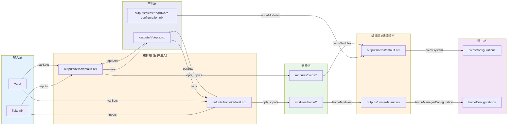

# 🏗️ 架构概览

[⬅️ 返回主文档](../README.md)

---

## 目录

- [1. 整体架构](#1-整体架构)
- [2. 核心维度一：细粒度（Fine-Grained Control）](#2-核心维度一细粒度fine-grained-control)
- [3. 核心维度二：高隔离（High Isolation）](#3-核心维度二高隔离high-isolation)
- [4. 核心维度三：松耦合（Loose Coupling）](#4-核心维度三松耦合loose-coupling)
- [5. 核心维度四：多模式（Multi-Mode）](#5-核心维度四多模式multi-mode)
- [6. 补充维度五：显式声明（Explicit Declaration）](#6-补充维度五显式声明explicit-declaration)
- [7. 补充维度六：约定优于配置（Convention over Configuration）](#7-补充维度六约定优于配置convention-over-configuration)
- [8. 补充维度七：声明式不可变基础设施（Declarative Immutable Infrastructure）](#8-补充维度七声明式不可变基础设施declarative-immutable-infrastructure)
- [9. 补充维度八：关注点分离（Separation of Concerns）](#9-补充维度八关注点分离separation-of-concerns)
- [10. 补充维度九：最小知识原则（Least Knowledge / Law of Demeter）](#10-补充维度九最小知识原则least-knowledge--law-of-demeter)

---

## 1. 整体架构



---

> **图中六层与九大维度的关系**：前九个维度分别对应架构的不同侧面 —— 细粒度控制横跨声明→消费→输出三层；高隔离在声明、消费、编排三层各自体现；松耦合通过编排层驱动全层次自动发现；多模式活跃于编排层和输出层。后五个补充维度则揭示了各层间的设计哲学：显式声明约束声明层→消费层交互，约定优于配置贯穿输入→输出全链路，声明式不可变是整座架构的基石，关注点分离驱动分层设计本身，最小知识原则保护消费层模块的独立性。建议阅读每个维度前先回顾架构图，找到它对应的图层位置。

## 2. 核心维度一：细粒度（Fine-Grained Control）

> **图层映射**：此维度的三层控制体系分别对应 **声明层**（optSets 组合抽象）、**消费层**（opts 逐项控制）和 **输出层**（批量实例生成）。

### 三层粒度控制体系

本框架提供三层递进式的粒度控制，从单个软件行为到大规模部署，满足不同场景的精确控制需求。

| 层级           | 控制范围         | 实现方式                                           | 典型场景                         |
| -------------- | ---------------- | -------------------------------------------------- | -------------------------------- |
| **opts 层**    | 单个软件行为     | `opts.<category>.<module>.enable` + 细化参数       | 精确开关某个工具，调整其配置参数 |
| **optSets 层** | 组合式抽象       | 预定义选项集 + `recursive.mergeAttrsList` 深度合并 | 减少样板代码，复用常见配置组合   |
| **批量输出层** | 大规模同质化实例 | `count` 变量 + `numberedStrings` 函数              | 企业多台同配置主机的快速生成     |

#### 层级详解

##### 第一层：opts 层 —— 单个软件行为的精确控制

每个主机或用户都拥有独立的 `opts.nix` 文件，采用层级化的属性结构组织配置项。这种设计使得每个软件的行为都可以被独立控制，不会产生隐式的全局状态污染。

```nix
# 示例：精确控制 SSH 服务和 Nix CLI 助手
{
  service = {
    openssh.enable = true; # 启用 SSH 服务
    nginx.enable = false;  # 禁用 Nginx
  };
  cli = {
    nh.enable = true;      # 启用 nh 工具
    bat.enable = false;    # 禁用 bat
    git.enable = true;     # 启用 git
  };
}
```

##### 第二层：optSets 层 —— 组合式抽象

当多个主机/用户共享相似的配置时，可以将公共配置提取为"选项集"（Option Set），然后通过深度合并算法将多个选项集组合在一起。这避免了重复配置，同时保持了灵活性。

```nix
# optSets/baseEnv.nix - 基础环境选项集
{
  cli = {
    nh.enable = true;
    git.enable = true;
    just.enable = true;
  };
}
```

##### 第三层：批量输出层 —— 大规模实例工厂

对于需要部署大量同构主机/用户的场景（如集群、实验室），通过 `count` 变量控制生成的实例数量，由 `outputs/nixos/default.nix` 或 `outputs/home/default.nix` 中的 `numberedStrings` 函数实现自动化批量生成。

### 设计思想

| 思想                                             | 在本框架中的体现                                                                                                            |
| ------------------------------------------------ | --------------------------------------------------------------------------------------------------------------------------- |
| **分层架构（Layered Architecture）**             | 清晰分离了输入层（flake.nix、vars/）、声明层（opts.nix）、编排层（outputs/default.nix）、消费层（modules/），每层只依赖前层 |
| **工厂模式（Factory Pattern）**                  | `lib.nixosSystem` / `homeManagerConfiguration` 封装了配置创建逻辑，通过 opts 参数化实现不同实例                             |
| **组合优于继承（Composition over Inheritance）** | `optSets` 通过 `recursive.mergeAttrsList` + `recursive.mergeAttrs` 组合多个选项集，而非建立继承链                           |
| **参数化类型/泛型思想**                          | opts 是统一配置接口，`pkgSets` 根据系统架构参数化生成不同的包集合                                                           |

---

## 3. 核心维度二：高隔离（High Isolation）

> **图层映射**：此维度的三层面隔离机制分别作用于 **声明层**（主机/用户间隔离）、**消费层**（模块间隔离）和 **编排层**（实例隔离）。

### 三层面隔离机制

高隔离确保系统的各个部分相互独立，故障不会横向传播，修改的影响范围可控。

| 隔离层面       | 隔离机制               | 实现方式                                                     | 隔离效果                             |
| -------------- | ---------------------- | ------------------------------------------------------------ | ------------------------------------ |
| **主机间隔离** | 独立目录结构           | 每个主机拥有独立的目录、opts.nix、hardware-configuration.nix | 一台主机的配置错误不影响其他主机     |
| **用户间隔离** | 独立 Home Manager 配置 | 每个用户拥有独立的 Home Manager 实例和 opts 子集             | 一个用户的桌面环境配置不影响其他用户 |
| **模块间隔离** | 条件激活 + opts 通信   | `lib.mkIf finallyEnable` 条件激活，模块间无直接依赖          | 禁用的模块完全不参与构建，零开销     |

### 设计思想

| 思想                                      | 在本框架中的体现                                                                   |
| ----------------------------------------- | ---------------------------------------------------------------------------------- |
| **沙盒/容器化思想（Sandboxing）**         | 每个主机、用户、模块都在自己的"沙箱"中运行，边界清晰                               |
| **故障隔离（Failure Isolation）**         | 一个模块的配置错误不会导致整个系统构建失败（禁用的模块不参与评估）                 |
| **信息隐藏（Information Hiding）**        | 模块内部实现对外部不可见，只能通过 `opts` 接口交互                                 |
| **接口隔离原则（Interface Segregation）** | 每个 module 只暴露最小必要的接口（即其对应的 opts 子集），不应强迫依赖不需要的接口 |

---

## 4. 核心维度三：松耦合（Loose Coupling）

> **图层映射**：此维度的自动发现机制由 **编排层** 驱动，覆盖 **输入层**（vars、optSets）、**声明层**（主机/用户）和 **消费层**（模块），依靠 `recursive.collectFilesToList`、`recursive.collectFilesToNestedAttrs` 等编排函数实现。

### 六层自动发现机制

松耦合的核心实现是**约定优于配置**的自动发现机制。系统在多个层级实现了自动扫描和加载，使得新增组件几乎无需修改现有代码。

| 层级              | 发现机制                                        | 新增操作            | 删除操作 | 发现位置                                                   |
| ----------------- | ----------------------------------------------- | ------------------- | -------- | ---------------------------------------------------------- |
| **主机 Host**     | `readDir ./.` + filter                          | 创建目录 + opts.nix | 删除目录 | [outputs/nixos/default.nix](../outputs/nixos/default.nix)  |
| **用户 User**     | `readDir ./.` + filter                          | 创建目录 + opts.nix | 删除目录 | [outputs/home/default.nix](../outputs/home/default.nix)    |
| **NixOS 模块**    | `recursive.collectFilesToList` 递归扫描         | 创建 .nix 文件      | 删除文件 | [modules/nixos/default.nix](../modules/nixos/default.nix)  |
| **Home 模块**     | `recursive.collectFilesToList` 递归扫描         | 创建 .nix 文件      | 删除文件 | [modules/home/default.nix](../modules/home/default.nix)    |
| **选项集 OptSet** | `recursive.collectFilesToNestedAttrs` 扫描 .nix | 创建 .nix 文件      | 删除文件 | [vars/optSets/](../vars/optSets/)（通过 vars/default.nix） |
| **变量 Vars**     | `recursive.collectFilesToNestedAttrs` 扫描 .nix | 创建 .nix 文件      | 删除文件 | [vars/default.nix](../vars/default.nix)                    |

### 设计思想

| 思想                                              | 在本框架中的体现                                                             |
| ------------------------------------------------- | ---------------------------------------------------------------------------- |
| **约定优于配置（Convention over Configuration）** | 遵循命名约定（`.nix` 文件、`default.nix`、目录结构）即可被自动发现，无需注册 |
| **开闭原则（Open/Closed Principle）**             | 对扩展开放（添加文件即生效），对修改关闭（无需改动现有代码）                 |
| **插件架构（Plugin Architecture）**               | 每个模块都是"插件"，放入目录即被加载，移除即卸载                             |
| **依赖倒置（Dependency Inversion）**              | 高层模块（主机配置）依赖抽象（opts 接口），不依赖具体模块实现                |
| **观察者/发布订阅简化版**                         | 模块"订阅"opts 中的特定路径，当 opts 变化时自动响应（通过 Nix 的惰性求值）   |

---

## 5. 核心维度四：多模式（Multi-Mode）

> **图层映射**：此维度表现出 **编排层**（批量/单机策略切换）和 **输出层**（独立/集成 Home 模式、多 nixpkgs 实例）的灵活性。

### 五种运行模式

本框架支持五种不同的运行模式，以适应从个人开发到企业部署的各种场景。

| 模式                | 触发条件                        | 适用场景                               | 关键代码位置                                              |
| ------------------- | ------------------------------- | -------------------------------------- | --------------------------------------------------------- |
| **单机模式**        | `count <= 1`（默认）            | 个人开发机、服务器                     | [outputs/nixos/default.nix](../outputs/nixos/default.nix) |
| **批量模式**        | `count > 1`                     | 企业同质化部署、集群                   | [outputs/nixos/default.nix](../outputs/nixos/default.nix) |
| **独立 Home 模式**  | `outputs/home/` 下的用户目录    | `nh home switch` 直接使用 Home Manager | [outputs/home/default.nix](../outputs/home/default.nix)   |
| **集成 Home 模式**  | NixOS 主机配置中的 `users` 定义 | 作为 NixOS 模块被主机导入              | [outputs/nixos/default.nix](../outputs/nixos/default.nix) |
| **多 nixpkgs 实例** | `pkgSets` 定义 3 套 pkgs        | 稳定性需求、版本锁定                   | `functions.mk.pkgSets`（repositories/ 中定义）            |

#### 模式详解

##### 模式 1 & 2：单机模式 vs 批量模式

这两种模式由同一个配置文件根据 `count` 变量的值动态切换：

```nix
# 单机模式 (count = 1)
hostNames = ["defualt"]
# 生成: nixosConfigurations.defualt = { ... }

# 批量模式 (count = 100)
hostNames = ["defualt-1", "defualt-2", ..., "defualt-100"]
# 生成: nixosConfigurations.defualt-1 = { ... }
#        nixosConfigurations.defualt-2 = { ... }
#        ...
```

##### 模式 3 & 4：独立 Home 模式 vs 集成 Home 模式

用户子系统支持两种不同的运行方式：

- **独立模式**：用户配置作为独立的 Flake 输出，可以通过 `nh home switch .#username` 直接使用
- **集成模式**：用户配置作为 NixOS 主机配置的一部分，由 `home-manager.nixosModules` 统一管理

```nix
# 独立模式的调用链
outputs/default.nix → home/default.nix → homeManagerConfiguration → homeConfigurations

# 集成模式的调用链
outputs/default.nix → nixos/default.nix → lib.nixosSystem → home-manager.nixosModules
```

##### 模式 5：多 nixpkgs 实例

框架通过 `functions.mk.pkgSets` 同时维护多个 nixpkgs 实例（定义在 `repositories/knightfemale/nur-packages/functions/mk/pkgSets.nix`）：

```nix
pkgSets = system: {
  pkgs = import nixpkgs { inherit system; };             # master（最新）
  pkgs-unstable = import nixpkgs-nixos-unstable { ... }; # nixos-unstable
  # 更多 pkgs 实例按需添加
};
```

### 设计思想

| 思想                                         | 在本框架中的体现                                                                  |
| -------------------------------------------- | --------------------------------------------------------------------------------- |
| **策略模式（Strategy Pattern）**             | 单机/批量模式通过 `count` 参数切换策略，`mkNixos` / `mkHome` 内部统一处理         |
| **多态（Polymorphism）**                     | 同一套用户配置可以在独立/集成两种上下文中运行，表现出不同的行为                   |
| **上下文参数化（Context Parameterization）** | 通过 `opts`、`system`、`pkgSets` 等参数将上下文信息注入，使同一套代码适应不同环境 |

---

## 6. 补充维度五：显式声明（Explicit Declaration）

> **图层映射**：此维度集中体现在 **声明层**（`opts.nix` 集中声明所有配置意图）和 **消费层**（模块通过 `opts.<分类>.<模块>` 接口读取配置）。

> _"Explicit is better than implicit."_ — The Zen of Python

### 核心理念

本框架遵循**显式优于隐式**的原则，要求所有可配置的行为都必须在 `opts.nix` 中明确声明。

### 设计要点

#### 1. 集中式配置管理

每个主机/用户的所有配置集中在一个 `opts.nix` 文件中：

```nix
# 所有行为一目了然
{
  cli.nh.enable = true;          # 我明确启用了 nh
  cli.bat.enable = false;        # 我明确禁用了 bat
}
```

没有隐藏的全局配置文件，没有魔法默认值，没有隐式的环境变量依赖。

#### 2. 无隐式全局状态

传统 NixOS 配置中常见的隐式问题在本框架中被消除：

| 隐式问题                                  | 本框架的解决方案                       |
| ----------------------------------------- | -------------------------------------- |
| 全局 `configuration.nix` 修改影响所有主机 | 每个主机独立 opts.nix                  |
| module 间的隐式依赖                       | 只能通过 opts 通信                     |
| 环境变量影响构建结果                      | 所有可能变化的因素都参数化             |
| "魔法"配置路径                            | 统一的 `opts.<category>.<module>` 规范 |

#### 3. 单一数据源原则（Single Source of Truth）

每个配置项只有一个权威来源：

- 主机配置的唯一真相源：`outputs/nixos/<host>/opts.nix`
- 用户独立配置的唯一真相源：`outputs/home/<user>/opts.nix`
- 可复用配置的组合源：`vars/optSets/*.nix`

### 价值

- **可审计性**：查看一个 opts.nix 即可了解该主机的全部配置意图
- **可重现性**：相同的 opts 总是产生相同的结果
- **可调试性**：配置问题时可以直接定位到具体的 opts 字段
- **团队协作**：Code Review 时只需关注 opts.nix 的变更

---

## 7. 补充维度六：约定优于配置（Convention over Configuration）

> **图层映射**：此维度贯穿 **输入层→声明层→编排层→消费层**，目录名即身份标识、放入即生效、文件发现协议等约定体系由编排层的自动发现函数统一执行。

> _"Convention over Configuration is not about having no configuration. It's about having sensible defaults and letting you override them when needed."_ — DHH (Rails 创始人)

### 核心理念

本框架大量借鉴了 Ruby on Rails 的 CoC 哲学，通过**强约定**减少必要的配置量。

### 约定体系

#### 1. 目录名 = 身份标识

```bash
outputs/nixos/<host>/
                ↑
            这就是主机名

outputs/home/<user>/
               ↑
           这就是用户名

modules/nixos/<category>/*.nix
                  ↑      ↑
                 分类   模块名
```

无需在任何地方"注册"这些名称——目录名本身就是身份。

#### 2. 放入即生效

新增一个模块的完整流程：

```bash
# 1. 创建文件
touch modules/nixos/service/*.nix

# 2. 完成！无需其他操作
```

无需：

- 在任何列表中添加引用
- 修改任何 import 语句
- 更新任何注册表
- 重启任何服务

#### 3. 自描述系统

目录结构本身即是文档：

```bash
看到这个结构，你就知道：
- 有 n 台主机
- 有 n 个独立用户
- 服务模块包括 openssh, nginx, greetd...
```

### 发现协议

框架实现了一套完整的**发现协议（Discovery Protocol）**：

| 协议规则                                          | 适用范围           |
| ------------------------------------------------- | ------------------ |
| 目录 + `opts.nix` = 有效主机/用户                 | 主机、用户         |
| 子目录中的 `.nix` 文件 = 模块                     | 系统模块、用户模块 |
| 目录中的 `.nix` 文件（排除 default）= 选项集/变量 | optSets、vars      |
| 文件名（去 .nix 后缀）= 键名                      | optSets、vars      |

### 价值

- **降低认知负荷**：学习一次约定，处处适用
- **提高开发效率**：新增功能的操作步骤最少化
- **一致性保证**：约定强制统一的结构和命名
- **新人友好**：阅读目录结构即可理解项目组织

---

## 8. 补充维度七：声明式不可变基础设施（Declarative Immutable Infrastructure）

> **图层映射**：此维度是整座架构的哲学基石 — **声明层**（declarative opts）、**消费层**（pure module functions）、**编排层**（combinator functions）、**输出层**（immutable store paths）共同体现了函数式声明式范式。

### 核心理念

本框架是**声明式**和**不可变性**原则的彻底实践者。

### 声明式（Declarative）

#### 描述期望状态，而非执行步骤

```nix
# 声明式：我想要什么
{
  cli.nh.enable = true;          # 我想要 nh 工具可用
  service.openssh.enable = true; # 我想要 SSH 服务启用
}

# 对比命令式：如何做到
# sudo systemctl enable sshd
# sudo nix-env -iA nixos.nh
# （还需要处理依赖、冲突、顺序...）
```

### 函数式编程思想

本框架深刻体现了函数式编程（FP）范式：

| FP 概念  | Nix 表达            | 本框架体现                                                         |
| -------- | ------------------- | ------------------------------------------------------------------ |
| 纯函数   | 相同输入 → 相同输出 | opts → configuration（确定性构建）                                 |
| 不可变性 | 值一旦创建不可修改  | store 路径不可变，新配置 = 新路径                                  |
| 引用透明 | 表达式可替换为其值  | Nix 的惰性求值和缓存                                               |
| 一等函数 | 函数可作为值传递    | `pkgSets`、`numberedStrings`、`checkAttrs` 等高阶函数              |
| 组合性   | 小函数组合成大功能  | `recursive.mergeAttrsList` + `recursive.mergeAttrs` 组合多个选项集 |

### 价值

- **版本控制**：所有配置在 Git 中管理
- **代码审查**：配置变更是 PR，可 review
- **测试**：可通过 `nix flake check` 验证
- **文档**：配置自解释（opts.nix 即文档）
- **自动化**：CI/CD 可自动部署

---

## 9. 补充维度八：关注点分离（Separation of Concerns）

> **图层映射**：此维度正是六层架构设计的根本动因 — **输入层**（原始素材）↔ **声明层**（配置意图）↔ **编排层**（发现与组装）↔ **消费层**（功能实现）↔ **输出层**（最终产物），每层职责单一。

### 核心理念

框架严格遵循 SoC 原则，将不同职责分配到不同的层次和模块中。

### 三层分离

#### 分离 1：nixos 模块 vs home 模块

```bash
modules/
├── nixos/
│   ├── service/openssh.nix     # 系统级：SSH 服务（需要 root）
│   └── hardware/networking.nix # 系统级：网络配置（需要 root）
└── home/
    ├── cli/bat.nix             # 用户级：bat 配置（用户空间）
    └── editor/nixvim.nix       # 用户级：Neovim 配置（用户空间）
```

- **nixos 模块**：运行在系统级别，影响所有用户，需要 root 权限
- **home 模块**：运行在用户级别，只影响当前用户，无需 root

#### 分离 2：选项定义（声明层） vs 选项消费（消费层）

```bash
outputs/nixos/<host>/opts.nix        # 声明层：我要什么
modules/nixos/service/openssh.nix    # 消费层：如何实现
```

- **声明层**（opts.nix）：声明式地描述期望状态
- **消费层**（module）：读取 opts 并实施配置

这种分离使得：

- 选项定义可以独立于实现进行审查
- 实现可以独立于具体配置进行复用
- 测试可以 mock opts 来验证模块行为

#### 分离 3：输出组装（编排层） vs 功能实现（消费层 + 输入层）

```bash
outputs/default.nix               # 编排层：发现与组装入口
outputs/nixos/default.nix         # 编排层：主机级别发现与组装（含两阶段：注入 + 输出）
modules/                          # 消费层：具体的功能实现
vars/                             # 输入层：原始变量和选项集素材
```

- **编排层**：负责发现、加载、合并，不包含业务逻辑（分为"合并注入"和"组装输出"两阶段）
- **消费层**：包含具体的配置逻辑，不知道自己如何被组装
- **输入层**：提供变量定义和可复用配置片段

### MVC 变体类比

可以将本框架类比为 MVC 模式的变体：

| MVC 组件   | 本框架对应                     | 职责                     |
| ---------- | ------------------------------ | ------------------------ |
| Model      | `opts.nix` (声明层)            | 数据模型，定义配置的状态 |
| View       | `nixosConfigurations` (输出层) | 最终呈现的系统状态       |
| Controller | `outputs/default.nix` (编排层) | 编排和协调               |

### 价值

- **模块独立性**：修改系统模块不影响用户模块，反之亦然
- **并行开发**：团队成员可以独立工作在不同的分离层次上
- **测试友好**：可以对每一层单独进行测试
- **可替换性**：可以替换实现而不影响接口（opts）

---

## 10. 补充维度九：最小知识原则（Least Knowledge / Law of Demeter）

> **图层映射**：此维度最直观地体现在 **声明层→消费层** 的数据流 — opts 是模块唯一的"朋友"，`opts.<分类>.<模块>` 隔离了模块间的直接知识。

### 核心理念

> _"Talk only to your immediate friends."_ — Law of Demeter

本框架严格遵循迪米特法则（Law of Demeter），限制模块之间的知识范围和交互方式。

### 法则在本框架中的体现

#### 1. 模块只通过 opts 获取数据

```nix
# ✅ 正确：模块只知道 opts
{ lib, opts, ... }:
let
  cfg = opts.service.openssh or { };
in
{ config = lib.mkIf cfg.enable { ... }; }

# ❌ 错误：模块尝试直接访问其他模块
{ lib, config, ... }:
let
  # 尝试读取 networking 模块的配置！违反 LoD
  networkCfg = config.services.networking or { };
in
{ ... }
```

#### 2. 模块不知道其他模块的存在

```bash
openssh.nix 不知道:
  - networking.nix 是否启用
  - firewall.nix 开放了哪些端口
  - users/admin 是否存在

它只知道:
  - opts.service.openssh.enable 是否为 true
  - opts.service.openssh 的其他配置参数
```

#### 3. opts.nix 是唯一的通讯录

```txt
模块间的"通话"必须经过 opts:

openssh.nix ──► opts.service.openssh ◄── alc/opts.nix
                                               │
networking.nix ◄── opts.hardware.networking ◄──┘
```

没有模块间的"私下交流"，所有数据流都经过 opts 这个"总机"。

### 轻量级中介者模式

opts.nix 扮演了 **中介者（Mediator）** 的角色，但比经典的 GoF 中介者模式更轻量：

| 经典中介者                       | 本框架的 opts           |
| -------------------------------- | ----------------------- |
| 显式的 Mediator 对象             | 隐式的 attrset 数据结构 |
| Colleague → Mediator → Colleague | Module → opts → Module  |
| Mediator 包含业务逻辑            | opts 是纯数据，无逻辑   |
| 需要注册/注销机制                | 自动发现，无需注册      |

### 价值

- **低耦合**：模块间的依赖关系被降到最低
- **高内聚**：每个模块只关心自己的配置领域
- **易维护**：修改一个模块不影响其他模块
- **易测试**：可以独立测试每个模块（mock opts 即可）
- **易理解**：模块的依赖关系一目了然（只依赖 opts）

---

<div align="center">

如有问题，欢迎查阅 ❓ [常见问题](./faq.md) 或提交 Issue

</div>
